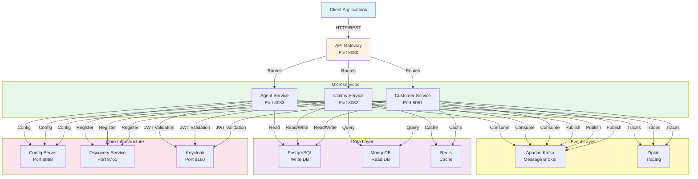
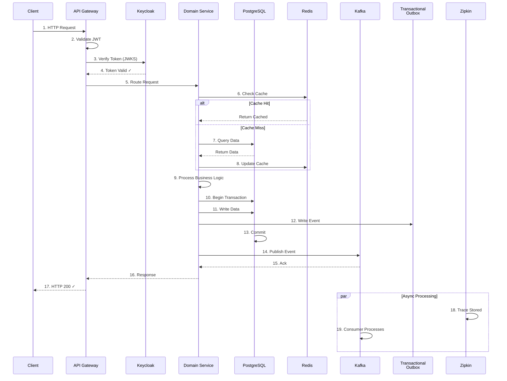
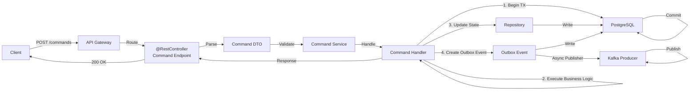
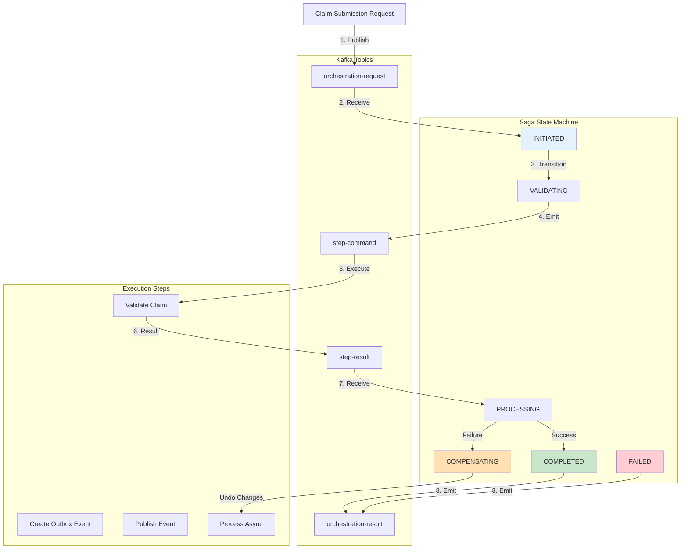
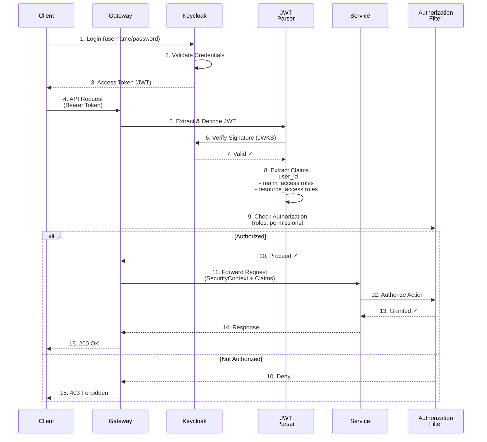
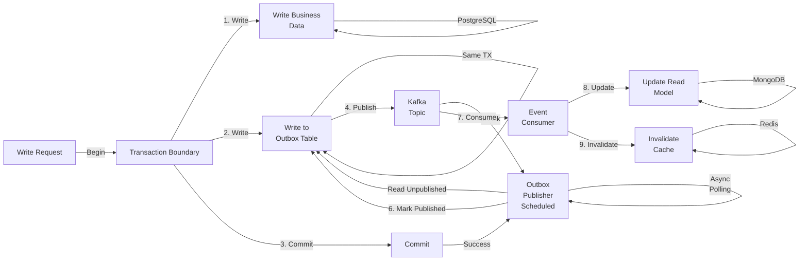
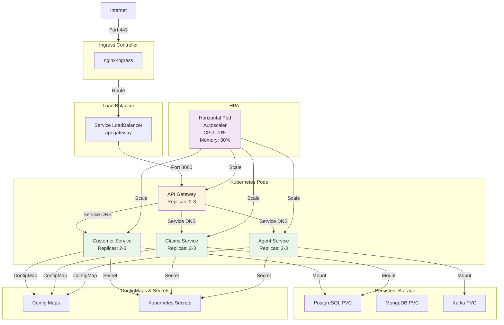
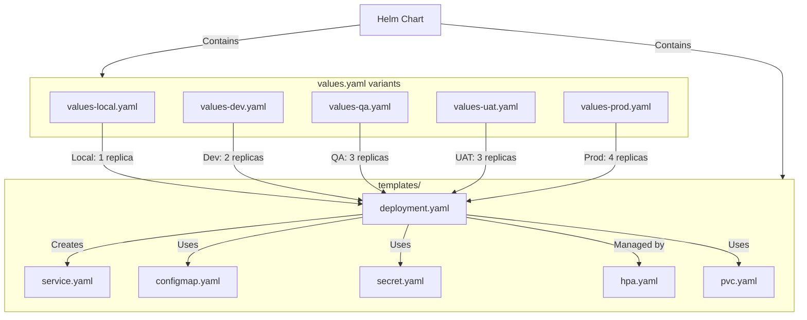
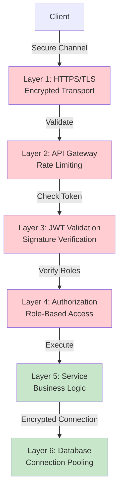

# Architecture Documentation

**Version:** 1.0.0  
**Last Updated:** 2026-08-04  
**Scope:** System architecture, component interactions, deployment topology

---

## 📐 Architecture Overview



---

## 🔄 Request Flow: End-to-End



---

## 📨 CQRS Command Flow



---

## 📖 CQRS Query Flow

```mermaid
graph LR
    Client["Client"]
    Gateway["API Gateway"]
    QueryCtrl["@RestController<br/>Query Endpoint"]
    QueryDTO["Query DTO"]
    QuerySvc["Query Service"]
    Handler["Query Handler"]
    Cache["Redis Cache"]
    Repo["Repository"]
    Mongo["MongoDB<br/>Read Model"]
    
    Client -->|GET /queries| Gateway
    Gateway -->|Route| QueryCtrl
    QueryCtrl -->|Parse| QueryDTO
    QueryDTO -->|Validate| QuerySvc
    QuerySvc -->|Handle| Handler
    
    Handler -->|Check| Cache
    
    alt Cache Hit
        Cache -->|Return| Handler
    else Cache Miss
        Handler -->|Read| Mongo
        Mongo -->|Data| Handler
        Handler -->|Cache Result| Cache
    end
    
    Handler -->|Response| QueryCtrl
    QueryCtrl -->|200 OK| Client
```

---

## 🎭 Saga Orchestration Flow



---

## 🔐 Authentication & Authorization Flow



---

## 💾 Transactional Outbox Flow



---

## 🔄 Kafka Message Flow

```mermaid
graph TB
    Producer["Claim Service<br/>Producer"]
    OutboxPub["Outbox Publisher"]
    Topic["Kafka Topic"]
    DLT["Dead Letter Topic"]
    Consumer["Claims/Agent Service<br/>Consumer"]
    Process["Process Message"]
    Success["Update State"]
    Failed["Write to DLT"]
    Retry["Retry with<br/>Backoff"]
    MaxRetry["Max Retries<br/>Exceeded"]
    
    Producer -->|Send| OutboxPub
    OutboxPub -->|Idempotent Delivery<br/>Enable: true| Topic
    Topic -->|Partition by<br/>Claim ID| Consumer
    
    Consumer -->|1. Receive| Process
    
    alt Success
        Process -->|2. Process| Success
        Success -->|Update State| Consumer
        Consumer -->|3. Commit Offset| Topic
    else Failure
        Process -->|Retry Count < 3| Retry
        Retry -->|Backoff: 1s→2s→4s| Topic
        Retry -->|Retry Exceeded| MaxRetry
        MaxRetry -->|Write| DLT
        DLT -->|Manual Investigation| Failed
    end
```

---

## 🎯 Redis Cache Flow

```mermaid
graph TB
    Request["Query Request"]
    Service["Service Layer"]
    Cache["Redis Cache"]
    DB["PostgreSQL"]
    
    Request -->|1. Request Data| Service
    Service -->|2. Check Cache<br/>Key: claim:status:{claimId}| Cache
    
    alt Hit
        Cache -->|3. Found| Service
        Service -->|4. Return Cached<br/>TTL: 30s| Service
    else Miss
        Cache -->|3. Not Found| Service
        Service -->|4. Query| DB
        DB -->|5. Return| Service
        Service -->|6. Cache Result<br/>TTL: 30s| Cache
        Cache -->|7. Stored| Cache
        Service -->|8. Return| Service
    end
    
    Service -->|Response| Request
```

---

## 🐳 Deployment Architecture - Kubernetes



---

## 🔗 Service-to-Service Communication

```mermaid
graph LR
    Caller["Claims Service<br/>(Caller)"]
    Circuit["Circuit Breaker<br/>(Resilience4j)"]
    Feign["Feign Client"]
    OAuth["OAuth2<br/>Client Credentials"]
    Discovery["Service Discovery<br/>(Eureka)"]
    Target["Customer Service<br/>(Target)"]
    
    Caller -->|1. Call via| Feign
    Feign -->|2. Resolve DNS| Discovery
    Discovery -->|3. Return Instances| Feign
    Feign -->|4. Circuit Status| Circuit
    
    alt Circuit Closed (Normal)
        Feign -->|5. Send Request| OAuth
        OAuth -->|6. Get Token| OAuth
        Feign -->|7. Add Authorization<br/>Bearer Token| Feign
        Feign -->|8. Call Service| Target
        Target -->|9. Response| Feign
        Feign -->|10. Record Success| Circuit
    else Circuit Open (Failed)
        Circuit -->|Fail Fast<br/>After 50% failures| Feign
        Feign -->|Retry with Backoff| Feign
    end
    
    Feign -->|11. Return to| Caller
```

---

## 📊 Component Interaction Matrix

| Source | Target | Protocol | Purpose | Security |
|--------|--------|----------|---------|----------|
| Client | Gateway | HTTPS | Public API | JWT Bearer |
| Gateway | Services | HTTP | Internal routing | Correlation ID |
| Services | Keycloak | HTTPS | Token verification | Client credentials |
| Services | PostgreSQL | TCP | Write operations | Connection pooling |
| Services | MongoDB | TCP | Read operations | Connection pooling |
| Services | Redis | TCP | Caching | Password protected |
| Services | Kafka | TCP | Event publishing | None (internal) |
| Services | Discovery | HTTP | Service registration | None (internal) |
| Services | Config Server | HTTP | Config retrieval | Git auth |
| Zipkin | Services | HTTP | Trace collection | None (internal) |

---

## 🎯 Deployment Topology - Helm



---

## 📈 Data Flow - Claim Submission

```mermaid
graph LR
    A["1. Client<br/>Submits Claim"]
    B["2. Gateway<br/>Validates JWT"]
    C["3. Claims Service<br/>Receives Request"]
    D["4. Business Logic<br/>Validation"]
    E["5. Save to<br/>PostgreSQL"]
    F["6. Create Outbox<br/>Event"]
    G["7. Commit Transaction"]
    H["8. Outbox Publisher<br/>Polls Event"]
    I["9. Publish to<br/>Kafka"]
    J["10. Consumers<br/>Process Event"]
    K["11. Update Read<br/>Models"]
    L["12. Invalidate<br/>Cache"]
    
    A -->|JWT| B
    B -->|Route| C
    C -->|Validate| D
    D -->|Transactional| E
    E -->|Same TX| F
    F -->|Atomic| G
    G -->|Async Poll| H
    H -->|Idempotent| I
    I -->|Partition| J
    J -->|Update| K
    K -->|Async| L
```



---

## 🔒 Security Layers



---

**Next:** Review specific guides for detailed implementation of each component.
