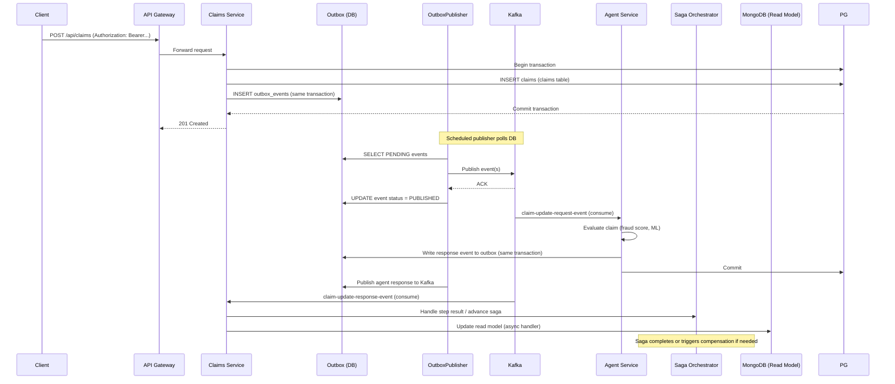

# Sequence Diagram — Claim Creation Flow

This sequence diagram shows the implemented claim creation flow using the transactional outbox and saga orchestration.

Last Updated: August 4, 2026

---

Mermaid sequence diagram

Notes:
- The diagram reflects the transactional outbox pattern: events are written to the database in the same database transaction as domain changes and a separate publisher publishes them to Kafka.
- Consumers write response events via their own outbox which the publisher will also publish.
- Read model updates are applied asynchronously from Kafka consumers to MongoDB.

